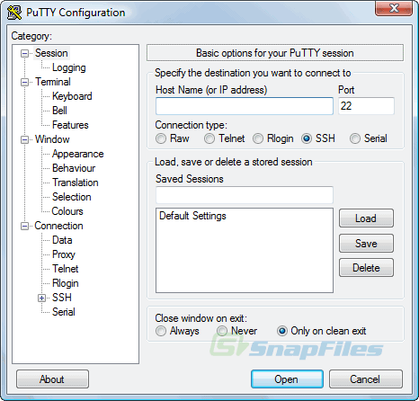

# Raspberry Pi als KNX-Bridge für IOS HomeKit

Quelle: [Boernyblog.de](https://www.boernyblog.de/raspberry-pi-3-als-knx-bridge-fuer-ios-homekit/)

## SD-Karte mit Betriebssystem Raspbian vorbereiten

1. Zuerst muss Etcher installiert werden, um komfortabel ein Image auf die SD-Karte zu schreiben. Hierzu einfach die aktuellste Version von der [Etcher Homepage](http://etcher.io) herunterladen und installieren
2. Jetzt das aktuelle Image des Basissystems für den Raspberry von der [raspberrypi Homepage](https://www.raspberrypi.org/downloads/) herunterladen. Für diese Anleitung wurde das Oktober Release von `RASPBIAN STRETCH WITH DESKTOP` verwendet, der Dateiname lautete `2017-09-07-raspbian-stretch.zip`.
3. Jetzt die SD-Karte in den Reader einlegen, mit dem Rechner verbinden und Etcher starten
4. In Etcher per `Select image` das in Schritt (2) heruntergeladene Image auswählen.
5. Im Anschluss das richtige Laufwerk auswählen und per `Flash!` den Flash-Vorgang starten.

## Remote-Zugriff aktivieren

Quelle: [linuxundich.de](https://linuxundich.de/raspberry-pi/ssh-auf-dem-raspberry-pi-aktivieren-jetzt-unter-raspian-noetig/)

1. Nach Abschluss des Flash-Vorgangs wird im Dateimanager eine neue Partition mit dem Namen "Boot" angezeigt. 
2. Auf dieser Partition muss eine neue, leere Datei mit dem Namen `ssh` angelegt werden
3. Unter OSX geht dies am einfachsten per Konsole. Unter Windows kann z.B. mit dem Editor `notepad` eine neue Datei angelegt werden.

        touch /Volumes/boot/ssh 
        
4. Nach dem Anlegen muss jetzt die Partition ausgeworfen werden.

## Hardware in Betrieb nehmen und ins Netzwerk bringen

1. Zuerst die SD-Karte in den Raspberry Pi einlegen
2. Jetzt den Raspberry Pi per Netzwerkkabel anschliessen und mit Strom versorgen

> Der Raspberry Pi kann am einfachsten direkt mit dem Router (z.B. Fritz-Box) verbunden werden. Er bekommt dann üblicherweise automatisch eine IP zugewiesen, die im Webinterfaces des Routers angezeigt wird. Für eine Inbetriebnahme kann der Raspberry Pi auch direkt per Netzwerkkabel mit einem PC/Laptop verbunden werden. Im letzteren Fall läßt sich die IP-Adresse des Raspberries mit `ping` herausfinden:
>
>     > ping raspberrypi.local
>     PING raspberrypi.local (169.254.213.122): 56 data bytes
>     64 bytes from 169.254.213.122: icmp_seq=0 ttl=64 time=0.489 ms
>     64 bytes from 169.254.213.122: icmp_seq=1 ttl=64 time=0.619 ms
>     ...
> 
> Im oberen Beispiel ist die IP-Adresse des Raspberry Pi **169.254.213.122**.

## SSH-Verbindung herstellen

1. Jetzt sollte die Verbindung per SSH möglich sein. Unter Windows wird `putty` benötigt um eine SSH-Verbindung aufzubauen. Das Programm gibt es auf der [Putty Download Seite](https://www.chiark.greenend.org.uk/~sgtatham/putty/latest.html). Zum derzeitigen Zeitpunkt ist die Version `putty-64bit-0.70-installer.msi` aktuell.
2. Nach der Installation PuTTY starten und als `Host Name` die Eingabe `pi@IP-ADRESSE` verwenden, also im oberen Beispiel `pi@169.254.213.122`.
    
  Quelle: [snapfiles.com](http://www.snapfiles.com/screenshots/putt.htm)
3. Es folgt eine Frage, ob dem Host zu vertrauen ist. Diese bitte bestätigen.
4. Danach folgt die Passwort-Abfrage. Das Standard-Passwort nach Neuinstallationen lautet `raspberry`. 
5. Um den Raspberry abzusichern, sollte nach dem Login das Passwort geändert werden. Dieses funktioniert unter Linux mit einem einfachen `passwd`

> Unter OSX ergibt sich also der folgenden Ablauf:
>  
> <pre>
> $ ssh pi@169.254.213.122
> The authenticity of host '169.254.213.122 (169.254.213.122)' can't be established.
> ECDSA key fingerprint is SHA256:uNquHmnCXhF/OrOxfx4vRgo58t/bteGWUnt0OpwRXjw.
> Are you sure you want to continue connecting (yes/no)? yes
> Warning: Permanently added '169.254.213.122' (ECDSA) to the list of known hosts.
> pi@169.254.213.122's password: 
> Linux raspberrypi 4.9.41-v7+ #1023 SMP Tue Aug 8 16:00:15 BST 2017 armv7l
> 
> The programs included with the Debian GNU/Linux system are free software;
> the exact distribution terms for each program are described in the
> individual files in /usr/share/doc/*/copyright.
> 
> Debian GNU/Linux comes with ABSOLUTELY NO WARRANTY, to the extent
> permitted by applicable law.
> Last login: Thu Sep  7 16:17:11 2017
> 
> SSH is enabled and the default password for the 'pi' user has not been changed.
> This is a security risk - please login as the 'pi' user and type 'passwd' to set a new password.
>            
> pi@raspberrypi:~ $ passwd
> Changing password for pi.
> (current) UNIX password: <b><i>raspberry</i></b>
> Enter new UNIX password: <b><i>NEUES-PASSWORT</i></b>
> Retype new UNIX password: <b><i>NEUES-PASSWORT</i></b>
> passwd: password updated successfully
> </pre>
> 
>> **Notiz zu Passwörtern:** Passwörter sollten einzigartig und gleichzeitig schwer sowohl durch Menschen und Maschinen zu erraten (=hart) sein. Dies führt leider dazu, dass Passwörter aber auch schwierig für Menschen erinnerbar werden, die diese Passwörter benötigen um auf geschützte Ressourcen zuzugreifen. Es empfiehlt sich daher, für die Verwaltung von Passwörtern einen Passwort-Safe zu verwenden (z.B. [KeePass](https://keepass.info)), in dem die Passwörter verschlüsselt gesichert werden. Der Passwort-Safe wird mit *einem* einzigartigen und harten Passwort gesichert. Moderne Passwort-Safes wie KeePass ermöglichen die Erstellung von Baumstrukturen (z.B. E-Mail-Konten, Server-Passwörter, Bank-Informationen), das automatische Erstellen von neuen Passwörtern und sogar den automatischen Login auf einer gesicherten Webseite aus dem Passwort-Safe heraus.

## Installation und Konfiguration der HomeBridge

TODO

## Konfiguration von KNX SHIM

TODO

## Installation und Konfiguration von KNXD

TODO
